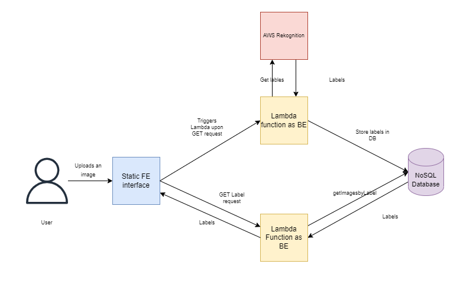

imagelabelling

Description
A serverless Web Application that labels images using AWS Rekognition service. It identifies objects in an image and displays the top 5 labels to the user. Additionally, it also shows the corresponding confidence of estimation for each label. Here, we demonstrate a useful application of image classification service and provide an easy-to-use implementation that can help users experiment with this service.
 
Architecture

 
Example

Requirements

    - Terraform >= 1.2.3
    - AWS CLI = 2.0.26
    - GitLab Account
    - AWS Secret Keys and Access Keys

Usage
1. Setting up the access key, secret key and default region on Gitlab as environment variables.
    https://about.gitlab.com/blog/2021/04/09/demystifying-ci-cd-variables/
 
2. Clone the project
    git clone https://git.it.hs-heilbronn.de/it/courses/msem/cc2/ss22/imagelabelling.git
 
3. Make the required change on the file and push the changes to the branch
    git add <files>
    git commit -m "Commit message"
    git push
 
4. The pipeline should trigger automatically in Gitlab. Go to CI/CD > Pipelines to see the status of the pipelines.
 
 
Authors
 
- sdhakal@stud.hs-heilbronn.de
- ssebastian@stud.hs-heilbronn.de